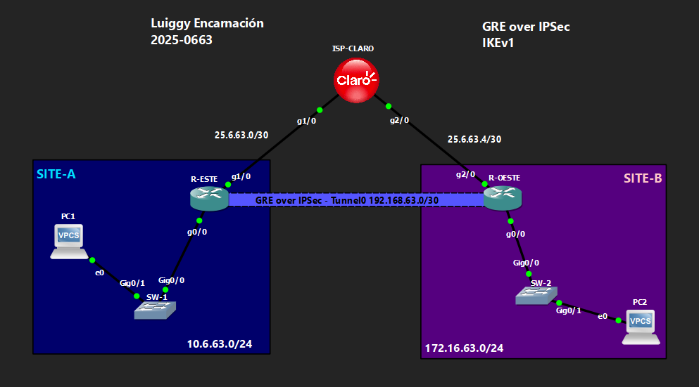

# 🔒 VPN Site-to-Site GRE over IPSec — IKEv1
 
**Luiggy Habraham Encarnación Cabrera · Matrícula 2025-0663**
 


 
> Túnel GRE cifrado con IPSec (IKEv1) entre dos sitios remotos, permitiendo enrutamiento dinámico OSPF sobre la VPN.

---

## 📑 Tabla de Contenido

1. [Objetivo del Laboratorio](#-objetivo-del-laboratorio)
2. [Parámetros Usados](#-parámetros-usados)
3. [Documentación de la Red](#️-documentación-de-la-red)
4. [Funcionamiento de la VPN](#-funcionamiento-de-la-vpn)
5. [Configuración](#-configuración)
6. [Verificación](#-verificación)
7. [Capturas de Pantalla](#-capturas-de-pantalla)
8. [Video de Demostración](#-video-de-demostración)

---

## 🎯 Objetivo del Laboratorio

Establecer un túnel **GRE encapsulado sobre IPSec** entre dos sitios remotos (SITE-A y SITE-B), usando **IKEv1** para la negociación de la Fase 1 y protegiendo el tráfico GRE mediante un `crypto map` aplicado a la interfaz WAN. El objetivo es permitir que las LANs de ambos sitios se comuniquen de forma cifrada y, adicionalmente, soportar enrutamiento dinámico (OSPF) sobre el túnel — algo que una VPN IPSec pura basada en políticas no permite, ya que no soporta tráfico multicast/broadcast.

---

## 🧩 Parámetros Usados

| Parámetro | Valor |
|---|---|
| Versión IKE | IKEv1 (ISAKMP) |
| Cifrado Fase 1 | AES 256 |
| Hash Fase 1 | SHA |
| Autenticación Fase 1 | Pre-shared key (`Luiggy20250663!`) |
| Grupo Diffie-Hellman | 14 |
| Lifetime ISAKMP | 86400 s |
| Transform-set (Fase 2) | esp-aes 256 + esp-sha-hmac |
| Modo IPSec | Transporte |
| Encapsulamiento | GRE punto a punto (`tunnel mode gre ip`) |
| Tráfico protegido | ACL `GRE-VPN` → protocolo GRE entre IPs públicas |
| Enrutamiento dinámico | OSPF área 0 sobre Tunnel0 |

---

## 🗺️ Documentación de la Red

### Topología



### Tabla de Direccionamiento

| Dispositivo | Interfaz | IP | Red |
|---|---|---|---|
| ISP-CLARO | g1/0 | 25.6.63.2/30 | Enlace hacia R-ESTE |
| ISP-CLARO | g2/0 | 25.6.63.5/30 | Enlace hacia R-OESTE |
| ISP-CLARO | Lo0 | 20.20.20.20/32 | Loopback de pruebas |
| R-ESTE | g1/0 (WAN) | 25.6.63.1/30 | Hacia ISP |
| R-ESTE | g0/0 (LAN) | 10.6.63.1/24 | SITE-A |
| R-ESTE | Tunnel0 | 192.168.63.1/30 | Túnel GRE |
| R-OESTE | g2/0 (WAN) | 25.6.63.6/30 | Hacia ISP |
| R-OESTE | g0/0 (LAN) | 172.16.63.1/24 | SITE-B |
| R-OESTE | Tunnel0 | 192.168.63.2/30 | Túnel GRE |

### Detalles del Entorno

| Parámetro | Valor |
|---|---|
| Emulador | GNS3 / Packet Tracer |
| Dispositivos Cisco | IOU / Router IOS |
| VLANs | VLAN 1 (default) en SW-1 y SW-2 |
| Sitios | SITE-A (10.6.63.0/24), SITE-B (172.16.63.0/24) |

---

## 🔬 Funcionamiento de la VPN

**Fase 1 (ISAKMP/IKEv1):**
- `crypto isakmp policy 10`: AES-256, SHA, autenticación por clave precompartida, grupo Diffie-Hellman 14.
- `crypto isakmp key` amarra la PSK a la IP pública del peer remoto (autenticación mutua por dirección).

**Fase 2 (IPSec):**
- `crypto ipsec transform-set VPN-SET esp-aes 256 esp-sha-hmac` en **modo transporte**, porque el encapsulamiento de red-a-red ya lo aporta el GRE; IPSec solo cifra el paquete GRE.
- La ACL `GRE-VPN` selecciona únicamente el tráfico **protocolo GRE entre las IPs públicas** de los routers — el "tráfico interesante" que activa el túnel IPSec.
- El `crypto map` se aplica sobre la interfaz WAN física, no sobre el Tunnel0.

**GRE:**
- `interface Tunnel0` con `tunnel mode gre ip`, origen/destino en las IPs públicas.
- Sobre esta interfaz corre **OSPF**, permitiendo que las rutas hacia las LANs remotas se aprendan dinámicamente — ventaja clave del GRE sobre IPSec puro.

---

## 🔧 Configuración

Ver archivo: `Configuración para VPN GRE over IPSec IKEv1.txt`

Resumen de bloques configurados por dispositivo:
- **ISP-CLARO**: solo enrutamiento estático, simula el proveedor (no participa en la VPN).
- **R-ESTE / R-OESTE**: ISAKMP, transform-set, ACL, crypto map, interfaz Tunnel0, OSPF.
- **SW-1 / SW-2**: switching básico de acceso para las LANs.

---

## ✅ Verificación

```
show ip route
show crypto isakmp sa
show crypto ipsec sa
show ip ospf neighbor
```

Se espera:
- `show crypto isakmp sa` → estado **QM_IDLE** (Fase 1 establecida).
- `show crypto ipsec sa` → contadores `#pkts encaps` / `#pkts decaps` incrementando.
- `show ip route` → ruta hacia la LAN remota aprendida vía OSPF a través de Tunnel0.

---

## 📸 Capturas de Pantalla

```
evidencias/
├── 01_topologia.png
├── 02_crypto_isakmp_policy.png
├── 03_crypto_map_tunnel.png
├── 04_show_crypto_isakmp_sa.png
├── 05_show_crypto_ipsec_sa.png
├── 06_show_ip_ospf_neighbor.png
├── 07_show_ip_route.png
└── 08_ping_pc1_pc2.png
```

---

## 🎬 Video de Demostración

> 📺 **[Ver demostración en YouTube →](https://youtu.be/YI3SoW0QTUQ)**
